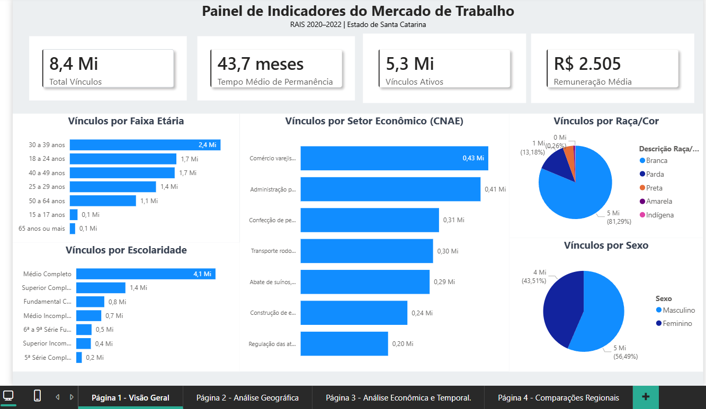
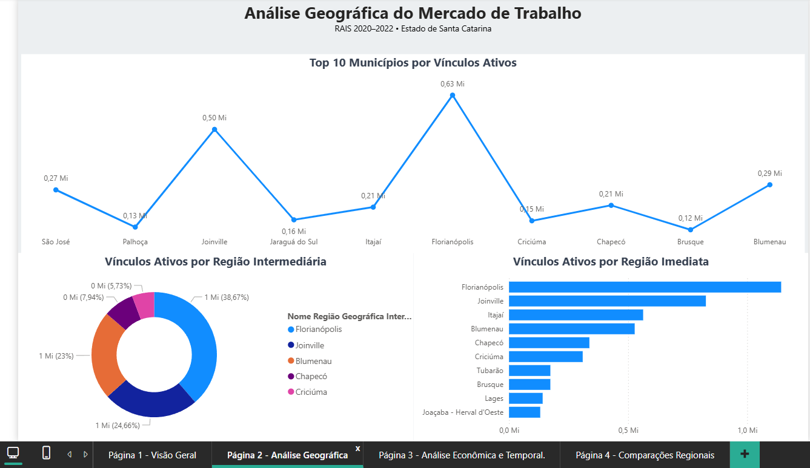
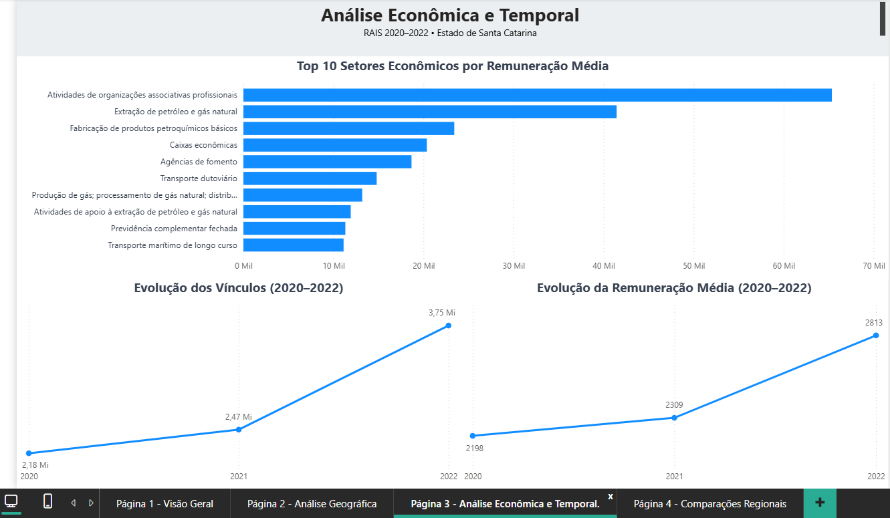
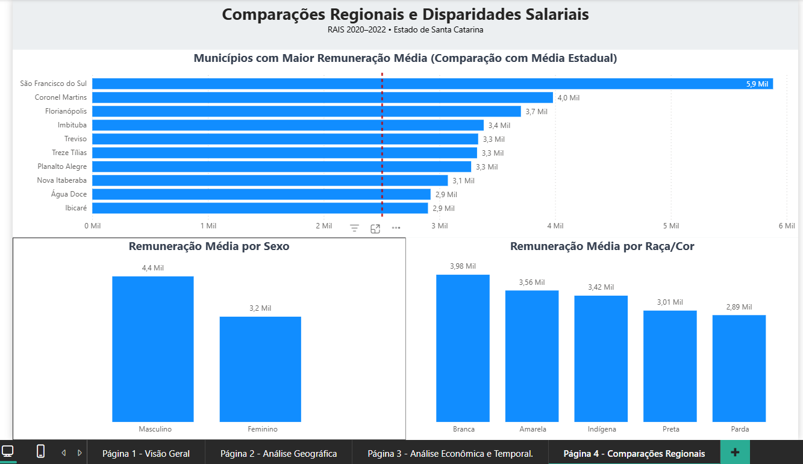

# Desafio Técnico – Analista de Dados (RAIS 2020–2022)

## Objetivo

Construir uma solução analítica utilizando dados da Relação Anual de Informações Sociais (RAIS) dos anos de 2020, 2021 e 2022, com foco na análise do mercado de trabalho formal no estado de Santa Catarina.

O projeto contempla todas as etapas do processo analítico, desde a preparação e consolidação dos dados até a construção de dashboards interativos no Power BI.

---

## Tecnologias Utilizadas

- Python
- Pandas
- Jupyter Notebook
- Power BI
- Git
- GitHub

---

## Etapas do Projeto

### 1. Inventário e Compreensão dos Dados

Nesta etapa foi realizada a exploração inicial das bases da RAIS 2020, 2021 e 2022, com o objetivo de compreender a estrutura dos dados, identificar as variáveis relevantes para as análises e mapear os relacionamentos necessários para a modelagem dimensional.

Foram avaliadas informações relacionadas à remuneração, vínculos empregatícios, perfil dos trabalhadores, localização geográfica e classificação econômica (CNAE).

### 2. Tratamento e Padronização

Após a análise inicial, foi realizada a preparação dos dados para garantir consistência entre as bases dos diferentes anos da RAIS.

Principais atividades executadas:

- Padronização dos nomes das colunas para um formato único.
- Conversão de tipos de dados para formatos adequados à análise.
- Tratamento de valores ausentes e registros inconsistentes.
- Padronização de categorias utilizadas nas análises demográficas.
- Criação de variáveis derivadas, como faixas etárias e indicadores de vínculos ativos.
- Validação da qualidade e integridade dos dados antes da consolidação das bases.

### 3. Consolidação das Bases

Após a etapa de tratamento e padronização, as bases da RAIS referentes aos anos de 2020, 2021 e 2022 foram integradas em uma única base analítica.

A consolidação permitiu a construção de uma visão histórica do mercado de trabalho formal em Santa Catarina, possibilitando análises comparativas entre períodos e a identificação de tendências ao longo do tempo.

Como resultado, foi criada uma base unificada contendo informações sobre vínculos empregatícios, remuneração, perfil dos trabalhadores, localização geográfica e atividade econômica, servindo como fonte para a modelagem dimensional e para os dashboards desenvolvidos no Power BI.

### 4. Modelagem Dimensional

Para otimizar o desempenho das análises e facilitar a construção dos dashboards, foi desenvolvido um modelo dimensional no formato Star Schema (Modelo Estrela).

A modelagem foi estruturada com uma tabela fato central contendo os registros dos vínculos empregatícios e tabelas dimensão responsáveis por fornecer o contexto analítico das informações.

#### Tabela Fato

- fato_vinculos

Armazena as métricas e informações relacionadas aos vínculos de trabalho, incluindo remuneração, tempo de emprego, situação do vínculo e chaves de relacionamento com as dimensões.

#### Tabelas Dimensão

- dim_municipio
- dim_cnae
- dim_escolaridade
- dim_faixa_etaria
- dim_raca
- dim_sexo

As dimensões permitem analisar os indicadores sob diferentes perspectivas demográficas, geográficas e econômicas, possibilitando segmentações e comparações utilizadas nos dashboards do Power BI.

---

## Indicadores Desenvolvidos

Foram desenvolvidas medidas analíticas para monitorar o mercado de trabalho formal sob diferentes perspectivas.

### Indicadores de Volume

- Total de Vínculos
- Vínculos Ativos
- Percentual de Vínculos Ativos
- Total de Desligamentos

### Indicadores de Remuneração

- Remuneração Média
- Remuneração Máxima
- Remuneração Mínima

### Indicadores de Permanência

- Tempo Médio de Emprego

### Indicadores de Cobertura Analítica

- Quantidade de Municípios
- Quantidade de CNAEs

---

## Dashboards Desenvolvidos

### Página 1 – Visão Geral

Indicadores principais:

- Total de vínculos
- Vínculos ativos
- Tempo médio de permanência
- Remuneração média

Análises realizadas:

- Vínculos por faixa etária
- Vínculos por escolaridade
- Vínculos por setor econômico (CNAE)
- Vínculos por raça/cor
- Vínculos por sexo

Objetivo:

Apresentar uma visão consolidada do mercado de trabalho formal em Santa Catarina, destacando indicadores gerais e o perfil dos trabalhadores.



---

### Página 2 – Análise Geográfica

Análises realizadas:

- Top 10 municípios por vínculos ativos
- Vínculos ativos por região intermediária
- Vínculos ativos por região imediata

Objetivo:

Identificar os principais polos de emprego formal e a distribuição geográfica dos vínculos no estado.



---

### Página 3 – Análise Econômica e Temporal

Indicadores analisados:

- Top 10 setores econômicos por remuneração média
- Evolução dos vínculos entre 2020 e 2022
- Evolução da remuneração média entre 2020 e 2022

Objetivo:

Avaliar tendências do mercado de trabalho formal e da remuneração ao longo do período analisado.



---

### Página 4 – Comparações Regionais e Disparidades Salariais

Análises realizadas:

- Municípios com maior remuneração média em comparação à média estadual
- Remuneração média por sexo
- Remuneração média por raça/cor

Objetivo:

Comparar o desempenho salarial dos municípios e identificar diferenças de remuneração entre grupos demográficos.



---

## Principais Insights

A análise dos dados da RAIS 2020–2022 permitiu identificar padrões relevantes sobre o mercado de trabalho formal em Santa Catarina.

### Mercado de Trabalho

- Observou-se crescimento do número de vínculos formais ao longo do período analisado, evidenciando a expansão do mercado de trabalho formal entre 2020 e 2022.
- Florianópolis, Joinville e Blumenau destacam-se como os principais polos de emprego formal do estado, concentrando parcela significativa dos vínculos ativos.

### Perfil dos Trabalhadores

- A faixa etária entre 30 e 39 anos representa a maior participação entre os trabalhadores com vínculo formal.
- O Ensino Médio Completo constitui o nível de escolaridade predominante entre os vínculos analisados.
- A distribuição dos vínculos por sexo e raça/cor evidencia a importância de análises segmentadas para compreensão da composição do mercado de trabalho.

### Remuneração

- Foram identificadas diferenças relevantes de remuneração entre municípios e setores econômicos.
- Alguns municípios apresentam remuneração média significativamente superior à média estadual, evidenciando desigualdades regionais.
- A análise indicou diferenças salariais entre os grupos avaliados.

---

## Estrutura do Projeto

```text
desafio_td_business/
│
├── notebook/
│   └── 002_exploracao.ipynb
│
├── assets/
│   ├── pagina_1.png
│   ├── pagina_2.png
│   ├── pagina_3.png
│   └── pagina_4.png
│
├── desafio_td_business.pbix
├── Desafio Técnico - Analista de Dados.pdf
├── README.md
├── requirements.txt
└── .gitignore
```

---

## Como Executar

### Ambiente Python

Instale as dependências do projeto:

```bash
pip install -r requirements.txt
```

### Dashboard Power BI

Abra o arquivo:

```text
desafio_td_business.pbix
```

utilizando o Power BI Desktop.

---

## Resultados

O projeto resultou na construção de uma solução analítica completa para exploração dos dados da RAIS 2020–2022, abrangendo desde o tratamento e consolidação das bases até a modelagem dimensional e o desenvolvimento de dashboards interativos no Power BI.

A solução permite analisar o mercado de trabalho formal em Santa Catarina sob diferentes perspectivas, incluindo aspectos demográficos, econômicos, temporais e regionais, apoiando a identificação de padrões, tendências e disparidades salariais.

Além dos resultados analíticos, o projeto demonstrou a aplicação prática de conceitos de preparação de dados, modelagem dimensional, criação de indicadores e visualização de informações para suporte à tomada de decisão.

---

## Autor

**Roberto Sulkovski**